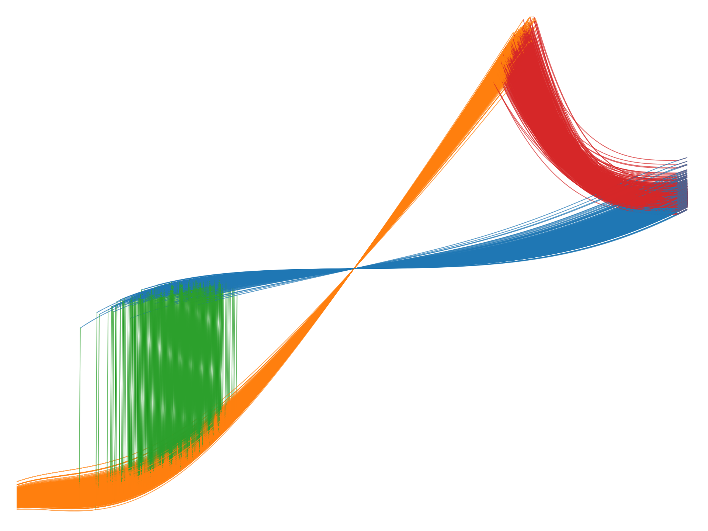

<h1 style="font-size:40px">
  

     
    Synaptogen
  

</h1>

This is a fast generative model for stochastic memory cells.  It helps determine how real-world devices would perform in large-scale circuits, for example when used as resistive weights in a neuromorphic system.

The model is trained on measurement data and closely replicates
- cross-correlations and history dependence of switching parameters
- cycle-to-cycle and device-to-device distributions
- multi-level resistance states
- resistance non-linearity

It is currently implemented in
- Julia for machine learning and general purpose programming ([Synaptogen.jl](Synaptogen.jl))
- Python (NumPy) ([Synaptogen.py](Synaptogen.py))
- Verilog-A for circuit-level simulations ([Synaptogen.va](Synaptogen.va))

You can check the respective subdirectories for instructions and examples.

## Publications

You can learn more about the model in the following publications:

[*A high throughput generative vector autoregression model for stochastic synapses*](https://www.frontiersin.org/journals/neuroscience/articles/10.3389/fnins.2022.941753/full)

[*Synaptogen: A cross-domain generative device model for large-scale neuromorphic circuit design*](https://doi.org/10.1109/TED.2024.3427616)

## Code authors

- Tyler Hennen (Synaptogen.jl & Synaptogen.py)
- Leon Brackmann (Synaptogen.va)
